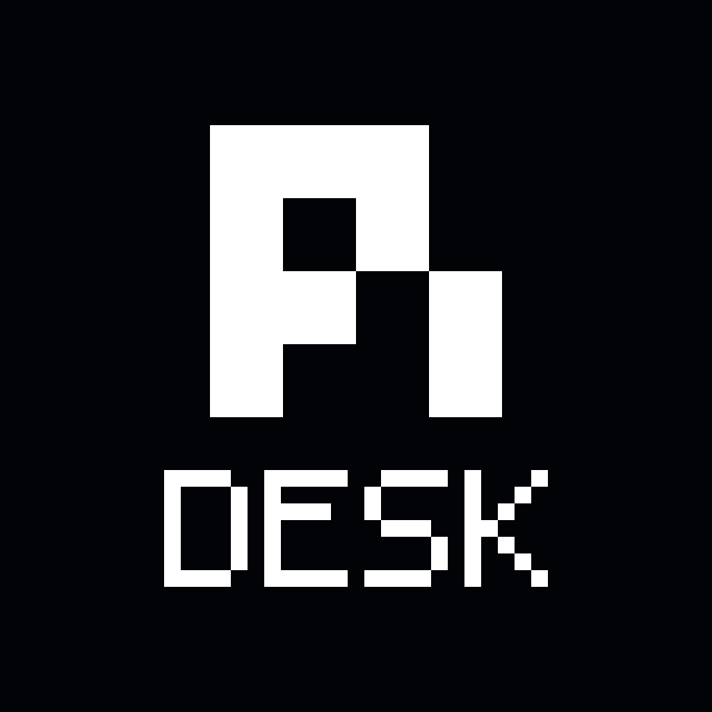

# Pi Desktop

A native-feeling desktop shell for the **Pi Coding Agent** CLI (`pi --mode rpc`).

<p align="left">
  <a href="https://github.com/gustavonline/pi-desktop/actions/workflows/ci.yml"></a>
  <a href="https://github.com/gustavonline/pi-desktop/releases"></a>
  <a href="./LICENSE"></a>
</p>

<p align="left">
  
</p>

Pi Desktop is intentionally **minimal** and **extension-first**:
- the desktop app is the host/shell,
- the `pi` CLI is the runtime,
- packages/extensions provide optional behavior.


---

## Why Pi Desktop exists

Pi Desktop gives you a stable desktop UX for Pi without hardcoding product logic into the app.

### Core philosophy

1. **Host boundary first**
   - Desktop app handles windows, panes, files, tabs, notifications, and native UX.
2. **Agent behavior stays in Pi + packages**
   - Workflows/policies should be extension-driven where possible.
3. **Multi-session reliability over gimmicks**
   - Runtime isolation, generation-safe switching, and persistence matter most.
4. **Calm UI**
   - Minimal visuals, neutral colors, low noise, and predictable controls.

### Current development direction

- **Core app focus:** UI polish, interaction quality, and performance (lighter/faster desktop shell).
- **Capability growth:** packages/extensions should drive optional workflows and policies.
- **Hardcoding rule:** avoid embedding project-specific automation/policy logic in app core.
- **Architecture intent:** Pi Desktop is a capability host for extensions, not a monolithic workflow engine.

### Recent highlights (post-0.1.7)

- Package-specific config moved out of global Settings and into a **Packages modal settings flow** (capability-driven, package-agnostic).
- Provider/runtime failures are now shown **inline in chat timeline** (CLI parity), including `stopReason: "error"` assistant failures.
- Windows missing-CLI onboarding/path discovery was expanded for common install paths and spawn error patterns.
- Session context menu now supports **Mark unread**.
- Native traffic-light controls now reveal `× / − / +` glyphs on hover/focus.
- Full icon set is now rebranded to the new **Pi DESK** mark (Pi monogram + pixel DESK wordmark), regenerated across all desktop/mobile bundle targets.

---

## Features

- Workspace + project sidebar with pin/reorder semantics
- Session tabs + file/terminal/packages tabs
- Streaming chat UI with tool blocks and thinking blocks
- Message actions (copy/resend, hover-revealed)
- Context usage ring + session stats
- Command palette + shortcuts panel
- Package manager pane (`pi install/remove/update/list`)
- Recommended package catalog
- **Package settings modal** with Save/Apply UX driven by discovered package capabilities
- Settings panel with simplified IA and diagnostics
- Inline runtime/provider error visibility in chat timeline (CLI-like error surfacing)
- Session context action to **Mark unread**
- First-run CLI onboarding when `pi` is missing
- In-app CLI update checks + update action
- Native notifications via extension UI boundary (`ctx.ui.notify`)

Detailed capability map: [`FEATURE_MAPPING.md`](./FEATURE_MAPPING.md)

---

## Download

Go to **[Releases](https://github.com/gustavonline/pi-desktop/releases)** and download:
- macOS: `.dmg` + app bundle archive (`.app.tar.gz`)
- Windows: `.exe` (NSIS installer) and/or `.msi`
- Linux: `.AppImage` and `.deb`

If no release is available yet, follow **Build from source** below.

### macOS Gatekeeper note (unsigned builds)

Until notarized signing is configured, macOS may block downloaded builds with messages like “app is damaged”.

Workaround:

```bash
xattr -cr /Applications/Pi\ Desktop.app
```

Then launch again (or right-click → Open).

---

## First run

On launch, Pi Desktop checks for the `pi` CLI.

If it is missing, the app shows an onboarding card with install instructions:

```bash
npm install -g @mariozechner/pi-coding-agent
```

Then click **Retry** in-app.

---

## Build from source

### Prerequisites

- Node.js >= 22
- Rust toolchain
- Platform build dependencies for Tauri 2

### Dev

```bash
npm install
npm run tauri dev
```

### Production build

```bash
npm run check
npm run build:frontend
npm run tauri build
```

Artifacts are generated under:

`src-tauri/target/release/bundle/`

---

## Architecture

See:
- **[`docs/ARCHITECTURE.md`](./docs/ARCHITECTURE.md)**
- **[`docs/CAPABILITY_MODEL.md`](./docs/CAPABILITY_MODEL.md)**

Short version:
- **Frontend (Lit/TypeScript)**: UI shell, panes, interactions
- **Tauri backend (Rust)**: native bridge, CLI process management, filesystem/window commands
- **Pi RPC bridge**: typed JSON-RPC-style line protocol over stdin/stdout
- **Packages/extensions**: opt-in behavior and UI integrations through the extension UI protocol

> Stack note: this project uses **Lit**, not React.

---

## Packages and extension model

See: **[`docs/PACKAGES.md`](./docs/PACKAGES.md)**

Pi Desktop treats packages as first-class building blocks:
- install globally or per project,
- surface loaded resources in-app,
- keep policy/automation outside the shell when possible.

---

## Security and permissions

See: **[`docs/PERMISSIONS.md`](./docs/PERMISSIONS.md)**

Tauri capabilities currently include filesystem and shell permissions needed to run Pi and manage project resources. Review before deploying in restricted environments.

---

## Releases

See: **[`docs/RELEASES.md`](./docs/RELEASES.md)**

Release-related docs:
- [`docs/RELEASES.md`](./docs/RELEASES.md)
- [`docs/ICONS.md`](./docs/ICONS.md) (icon source + regeneration + validation)

GitHub Actions workflows are set up for:
- CI validation
- tagged cross-platform release builds (macOS + Windows + Linux)

---

## Contributing

- Read [`CONTRIBUTING.md`](./CONTRIBUTING.md)
- Open an issue before large changes
- Keep changes aligned with extension-first architecture and minimal UX goals

---

## License

MIT — see [`LICENSE`](./LICENSE)

---

## Star history

[](https://www.star-history.com/#gustavonline/pi-desktop&Date)
